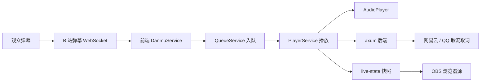
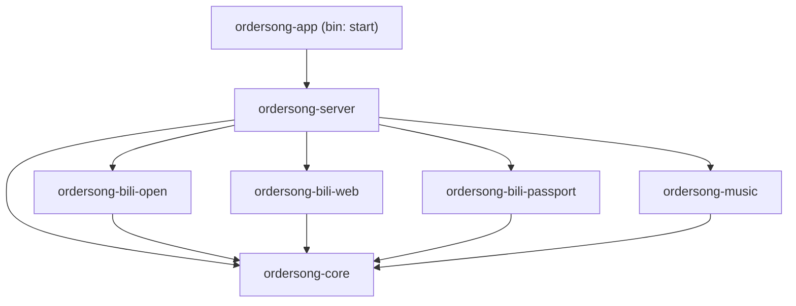
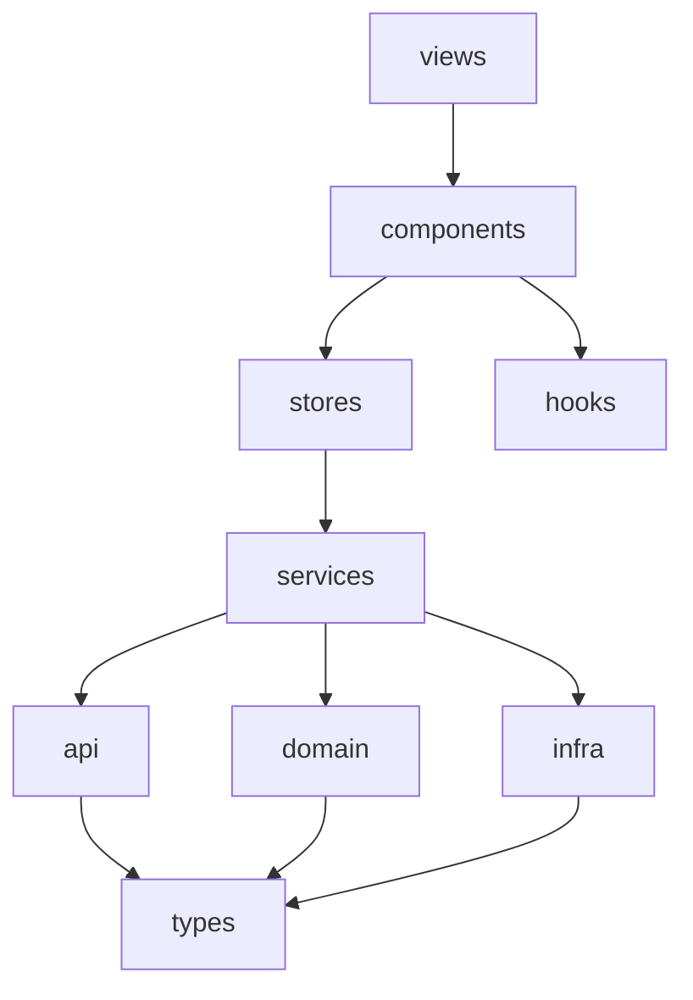

# 架构说明

本项目是一个「B 站弹幕点歌」桌面应用：主播在直播姬/桌面端运行，观众发弹幕点歌，应用自动取歌、播放，并通过 OBS 浏览器源把歌词/队列叠加到直播画面。

后端为 Rust（Cargo Workspace 多 crate），前端为 TypeScript + SolidJS，二者通过本机 HTTP + JSON 通信（应用内嵌 axum 服务监听 `127.0.0.1:17777`）。

## 整体数据流

## Rust 后端 (desktop-tauri/src-tauri)

Cargo Workspace，按职责切分为 7 个 crate，依赖自底向上单向流动：

| crate | 职责 | 说明 |
|---|---|---|
| `core` | 配置 / 错误 / 路径 / 共享常量 | 零网络与文件副作用（仅配置读取），不依赖 Tauri/axum |
| `bili-open` | 开放平台「互动玩法」HTTP 客户端 | `gameStart/End/heartbeat` + HMAC-SHA256 头签名 |
| `bili-web` | 房间号网页弹幕协议 HTTP | 房间号转换、`getDanmInfo`/`getConf`、WBI 签名 |
| `bili-passport` | B 站扫码登录 | 二维码生成/轮询、登录态查询（不含自动取身份码） |
| `music` | 网易云 + QQ 音乐 | 网易云 weapi(AES+RSA)、QQ musicu.fcg |
| `server` | axum 装配 | AppState、路由、统一中文错误 `ApiError` |
| `app` | Tauri 桌面壳 | 唯一可执行 crate，托盘 + 登录 webview + 启动流程 |

### 错误处理约定

- 业务 crate 内部错误用 `thiserror` 定义类型。
- 路由层用 `server::error::ApiError`，`IntoResponse` 统一转成 `{ "code": <非0>, "message": <中文> }`。
- 上游接口（B 站/网易云/QQ）的业务错误一律包装成中文 message 透传给前端，HTTP 状态保持 200，前端按 `body.code` 判断。

## TypeScript 前端 (frontend/src)

按 Clean Architecture 分层，依赖单向向下：

| 层 | 目录 | 职责 |
|---|---|---|
| types | `types/` | 领域类型唯一来源（song/order/danmu/live） |
| domain | `domain/` | 纯函数：优先级、队列规则、冷却、LRC 解析、弹幕命令解析（零副作用，可直接单测） |
| api | `api/` | 瘦 HTTP 客户端，一个文件对应一组后端路由 + 中文错误归一化 |
| infra | `infra/` | 副作用封装：AudioPlayer、弹幕 WebSocket 客户端、localStorage+AES、Tauri invoke |
| services | `services/` | 应用编排：PlayerService / DanmuService / QueueService / MusicService / AuthService |
| stores | `stores/` | Solid 信号 + 持久化（settings / session / queue / notice / stats / liveState） |
| components / views | `components/`、`views/` | UI 与四类 OBS 浏览器源视图（stream / lyrics / list / audio） |

## 跨进程播放同步

主程序（`?view=full`）周期把播放快照 POST 到 `/live-state`；OBS 浏览器源（`?view=lyrics|stream|list|audio`）周期 GET 并渲染，从而歌词/叠加层无需各自起播放器。

`audio` 视图额外拿快照里的 `nowUrl`（当前音频直链）在 CEF 里再播一次，OBS Browser Source 会作为独立音轨采到，绕开 Application Audio Capture 抓不到 WebView2 子进程的问题。与主程序进度漂移 >0.8s 时自动 seek 对齐。

## 跨客户端共享配置

桌面主窗口与浏览器打开的同一 URL 各有独立 localStorage。`/app-config` 把关键配置（登录 cookie / 身份码 / 设置 / 黑名单）集中托管到后端并落盘，实现「一次登录，处处可用」。
